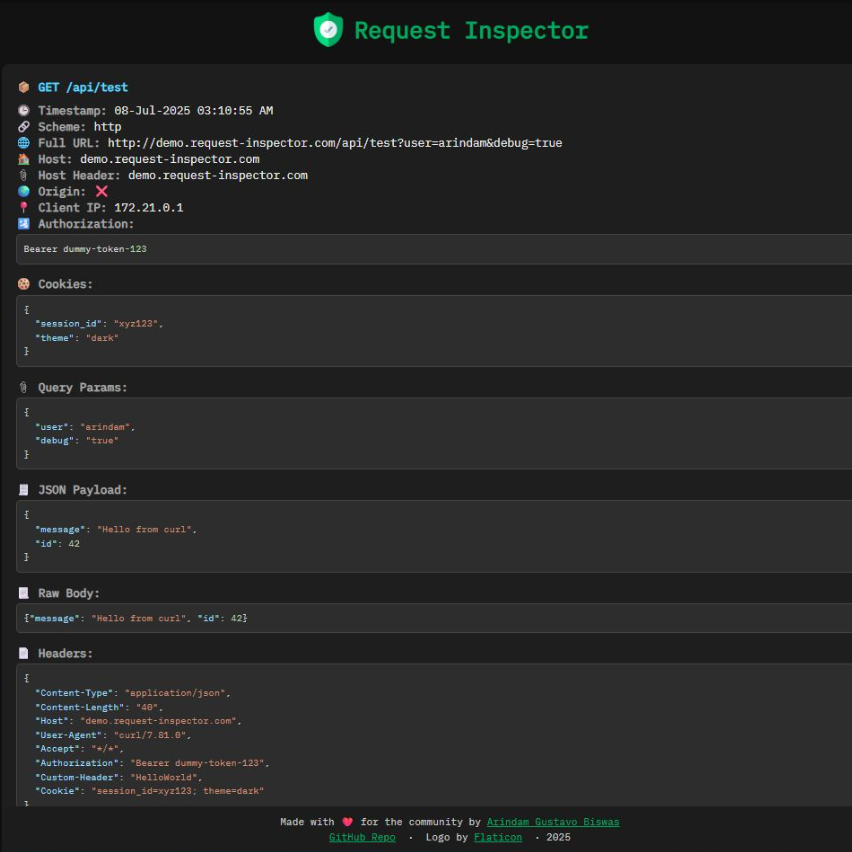
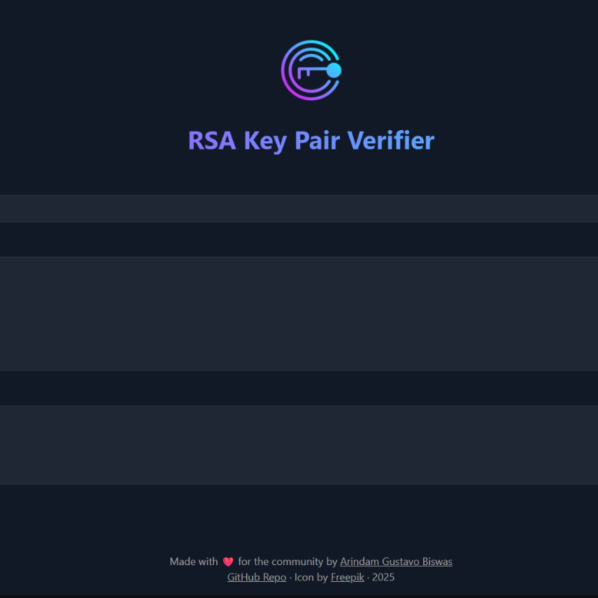
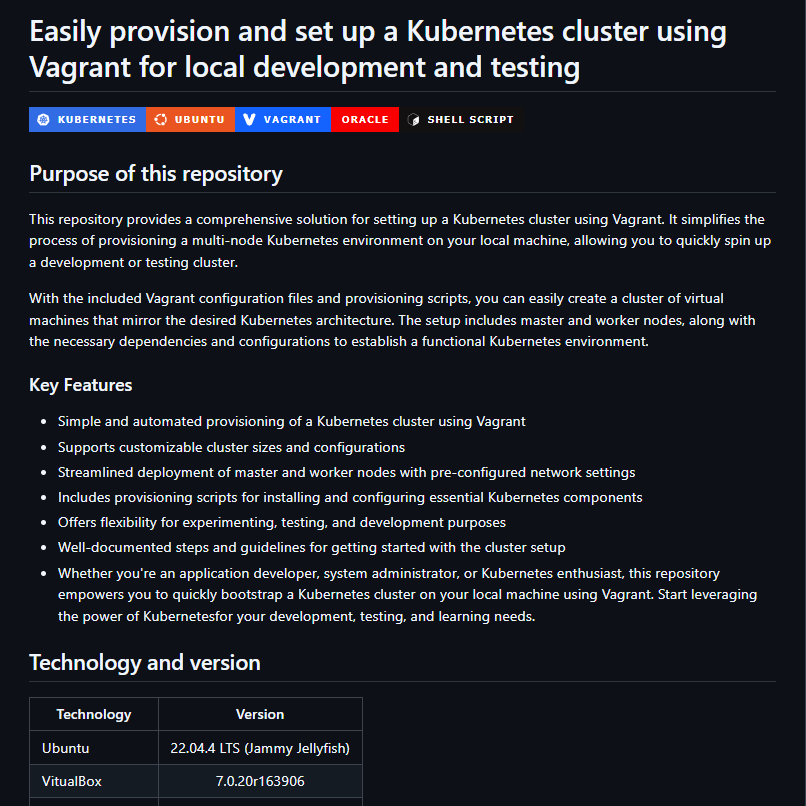
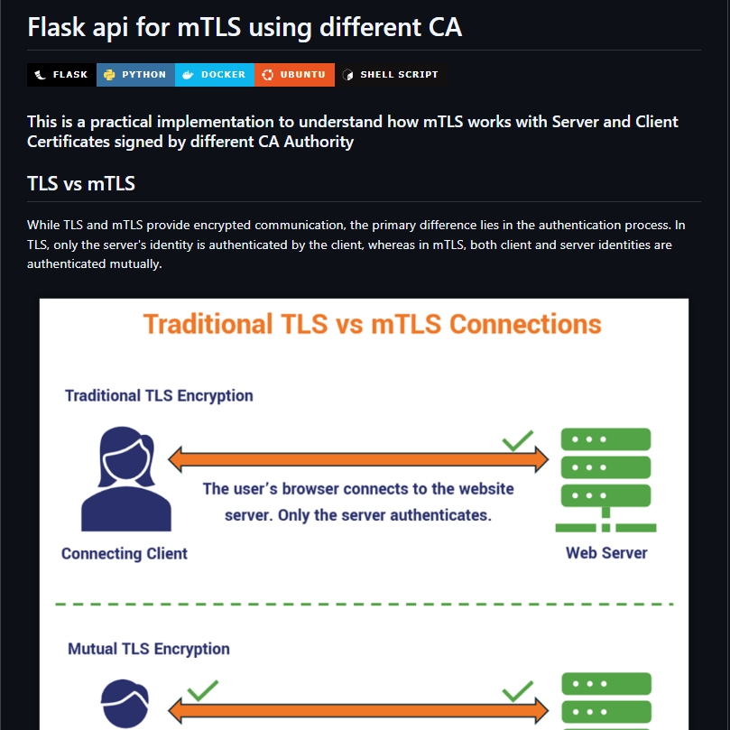
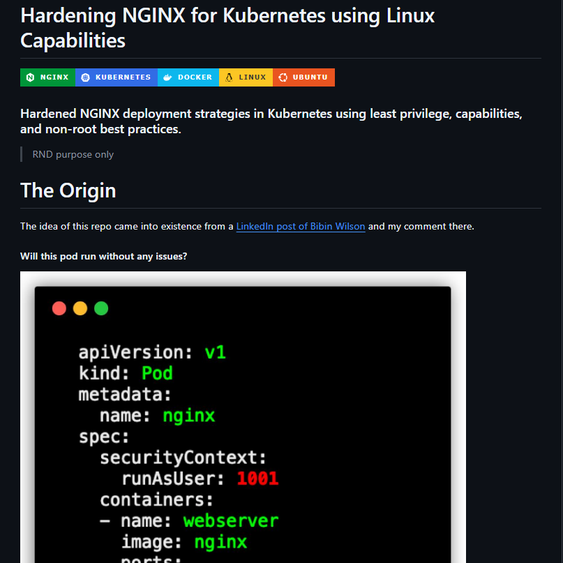
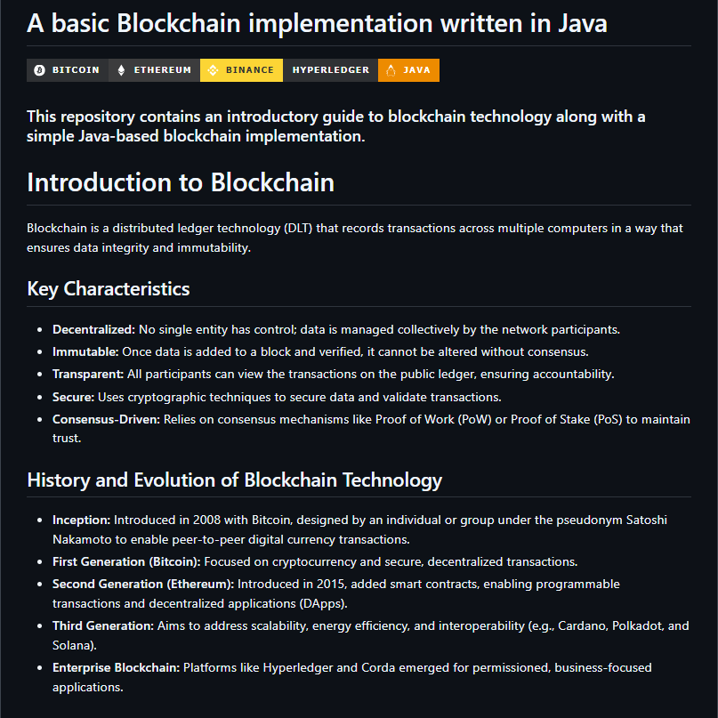

# 🐦‍🔥 Arindam Gustavo Biswas

### **`A passionate ♾️DevOps Engineer & Kubestronaut`** 

##  

<h3 align="left">[ 👨‍🚀 ] A Bit About Me</h3>

- 🌱 I’m currently working on **`Self Development`**

- 🧭 I’m currently learning **`To Set Priorities`**

- 💡 I like to talk about **`API, Automation, DevOps and Kubernetes`**

- 💬 Ask me about **`Kubernetes, Docker and Linux`**

- 🌐 Check my web at [`arindamgb.com`](https://arindamgb.com)

- ☸️ My `Kubestronaut` Profile at [`cncf.io`](https://www.cncf.io/training/kubestronaut/?_sft_lf-country=bd&p=arindam-gustavo-biswas)

##

<h3 align="left"> [ ➕ ] Let’s Connect</h3>

##

<h3 align="left"> [ ⚔️ ] My Tech Arsenal</h3>

#### `🛠️ DevOps`

#### `🔧 Dev (Development)`

#### `🔨 Ops (Operations)`

##

<h3 align="left"> [ ⚡ ] Project Showcase</h3>

<table>
  <!-- Row 1 -->
  <tr>
    <td align="center" width="33%" valign="top">
      <table width="100%" height="250">
        <tr>
          <td align="center" valign="middle">
            
          </td>
        </tr>
      </table>
      

        <b>Request Inspector</b>  
        
         
        
      

    </td>
    <td align="center" width="33%" valign="top">
      <table width="100%" height="250">
        <tr>
          <td align="center" valign="middle">
            
          </td>
        </tr>
      </table>
      

        <b>RSA Key Pair Verifier</b>  
        
         
        
      

    </td>
    <td align="center" width="33%" valign="top">
      <table width="100%" height="250">
        <tr>
          <td align="center" valign="middle">
            
          </td>
        </tr>
      </table>
      

        <b>Kubernetes Cluster using Vagrant</b>  
        
         
        
      

    </td>
  </tr>
  <!-- Row 2 -->
  <tr>
    <td align="center" width="33%" valign="top">
      <table width="100%" height="250">
        <tr>
          <td align="center" valign="middle">
            
          </td>
        </tr>
      </table>
      

        <b>MTLS Hands On</b>  
        
         
        
      

    </td>
    <td align="center" width="33%" valign="top">
      <table width="100%" height="250">
        <tr>
          <td align="center" valign="middle">
            
          </td>
        </tr>
      </table>
      

        <b>Kubernetes Nginx Hardening</b>  
        
         
        
      

    </td>
    <td align="center" width="33%" valign="top">
      <table width="100%" height="250">
        <tr>
          <td align="center" valign="middle">
            
          </td>
        </tr>
      </table>
      

        <b>Blockchain For Noobs</b>  
        
         
        
      

    </td>
  </tr>
</table>

##

<h3 align="left"> [ 📊 ] My Activity Feed</h3

&nbsp;

##

   
  <strong>This GitHub Repo was created with Love ❤️ and Coffee ☕</strong> 
  <small>Thanks for stopping by — happy coding!</small> 
  <h1 align="center">&lt;&nbsp;/&nbsp;&gt;</h1>

